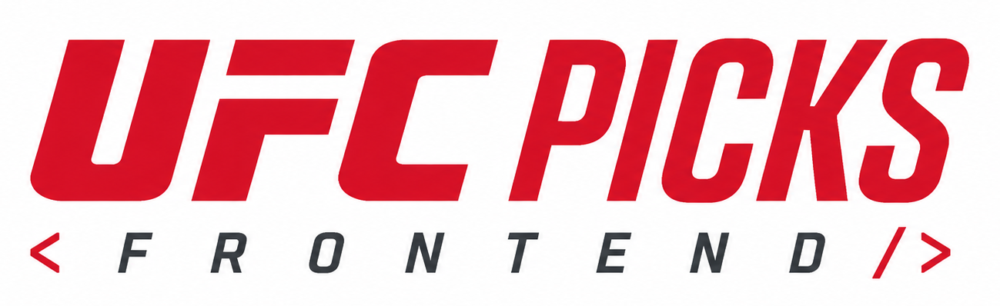

<div align="center">



# 
### A fight-night prediction experience built around UFC events, picks and competition.

Pick winners, predict methods and rounds, track your accuracy, and compete on global and event leaderboards.

<br>

[](https://nextjs.org/)
[](https://react.dev/)
[](https://www.typescriptlang.org/)
[](https://tailwindcss.com/)

<sub>Event cards · Fight predictions · Personal stats · Competitive leaderboards</sub>

</div>

## The fight-night experience

UFC Picks brings an entire card into one focused experience: the next event,
its countdown, matchups, fighter records and countries, title fights, and the
predictions that turn every result into a competition.

## Core features

- Upcoming-event dashboard with countdown and pick-lock status.
- Winner, method, and round predictions for every bout on the card.
- Pick history, accuracy, points, and personal performance statistics.
- Global and event leaderboards.
- Google sign-in, responsive layouts, and an accessible dark interface.

## Tech stack

| Area | Technology |
| --- | --- |
| Framework | Next.js 16, React 18, TypeScript |
| UI | Tailwind CSS, Radix UI, Framer Motion |
| Data and forms | TanStack Query, React Hook Form, Zod |
| Product integrations | Google OAuth, Recharts |
| Hosting | Vercel |

## Getting started

### Prerequisites

- Node.js 18 or later
- npm

### Run locally

```bash
git clone https://github.com/JoseZum/ufc-picks-frontend.git
cd ufc-picks-frontend
npm install
npm run dev
```

Open [http://localhost:12000](http://localhost:12000).

## Configuration

The development server proxies API requests to `http://localhost:8000` by
default. To point the web app at another API, create `.env.local`:

```dotenv
NEXT_PUBLIC_API_URL=https://your-api.example.com
BACKEND_URL=https://your-api.example.com
```

`NEXT_PUBLIC_API_URL` is available to browser code; `BACKEND_URL` is used by
the server-side proxy.

## Quality

```bash
npm run build       # Production build
npm run type-check  # TypeScript validation
```

## UFC Picks ecosystem

- [Platform overview](https://github.com/JoseZum/ufc-picks)
- [Web App](https://github.com/JoseZum/ufc-picks-frontend)
- [API](https://github.com/JoseZum/ufc-picks-backend)
- [Data Pipeline](https://github.com/JoseZum/ufc-picks-scraper)

<div align="center">

`ingest → predict → score → rank`

</div>
